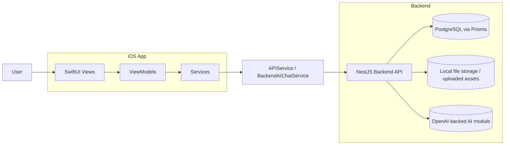
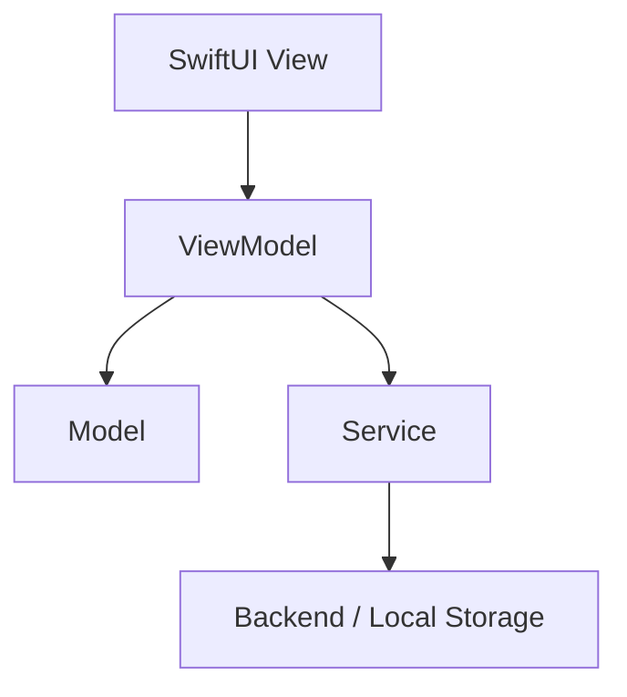
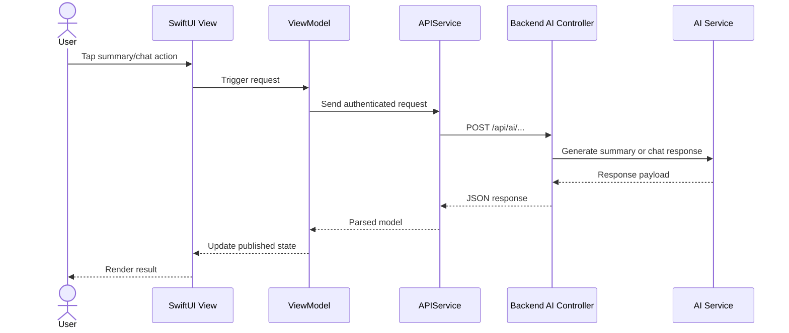
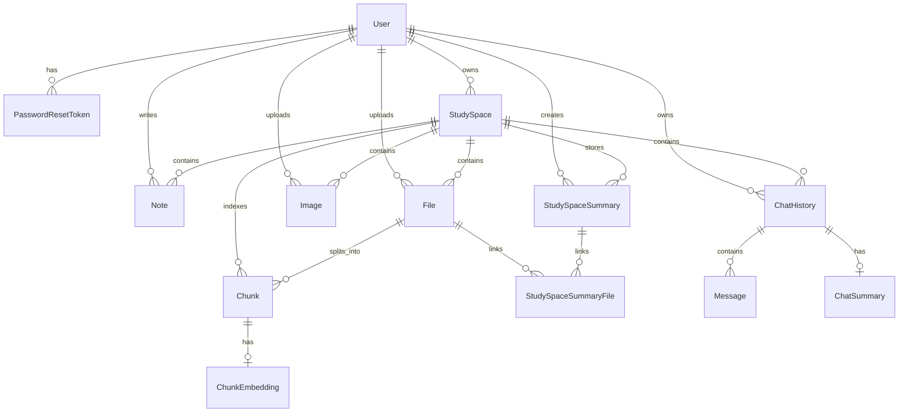

# SmartStudyCompanion Architecture

## 1. System Overview

SmartStudyCompanion uses a SwiftUI frontend, a NestJS backend, and Prisma/PostgreSQL for backend persistence. The frontend presents a study workspace experience and the backend supplies authentication, study-space data, files, notes, AI summary, and AI chat APIs.

## 2. High-Level System Architecture

## 3. Frontend Architecture

The iOS app is organized by responsibility:

- App entry: `SmartStudyCompanionApp.swift`
- Authentication: `AuthenticationFlowView`, `LoginView`, `SignUpView`
- Dashboard: `HomeDashboardView`
- Library: `LibraryView`
- Workspace: `ActiveWorkspaceView`, `CreateStudySpaceView`, note/material editors
- Summary: `SummaryDetailView`
- AI chat: `AIChatView`

### Frontend MVVM

The active view models include:

- `AuthViewModel`
- `HomeDashboardViewModel`
- `LibraryViewModel`
- `StudySpaceStore`
- `ActiveWorkspaceViewModel`
- `SummaryDetailViewModel`
- `AIChatViewModel`

## 4. Backend Architecture

The backend is a NestJS application located in `backend/smart-study-companion`.

### Active modules

- `auth`
- `user`
- `study-space`
- `note`
- `file`
- `image`
- `ai`
- `file-storage`
- `mail`
- `password-reset-token`

### Backend responsibilities

- controllers handle request entry points
- services hold domain logic and orchestration
- repositories talk to Prisma or storage layers
- guards protect authenticated routes
- validation pipes sanitize request bodies

## 5. Data and Storage Architecture

### Backend database

The Prisma schema defines the backend data model over PostgreSQL.

### Important backend entities

- `User`
- `PasswordResetToken`
- `StudySpace`
- `Note`
- `File`
- `Image`
- `StudySpaceSummary`
- `StudySpaceSummaryFile`
- `Chunk`
- `ChunkEmbedding`
- `ChatHistory`
- `ChatSummary`
- `Message`

### Frontend local storage

The active iOS runtime uses file-backed local services for:

- workspace materials
- workspace notes
- summary history
- chat history

The project also contains a CoreData layer, but the current active workspace flow relies primarily on the local file-backed services.

## 6. API Communication Flow

The frontend API client is `APIService`. It communicates with the backend using JSON requests and protected JWT routes.

Common request flow:

1. SwiftUI view triggers a user action
2. ViewModel validates input and sets loading state
3. Service performs request
4. Backend controller validates and forwards to service
5. Response returns to the ViewModel
6. ViewModel updates published state
7. SwiftUI view refreshes

## 7. Service Layer Responsibilities

- `APIService`: main backend client, auth token handling, route calls
- `BackendAIChatService`: AI chat request wrapper around `APIService`
- `WorkspaceMaterialStorageService`: local file persistence and text extraction for uploaded materials
- `WorkspaceNoteStorageService`: local note persistence
- `WorkspaceChatHistoryStorageService`: local chat history persistence
- `WorkspaceSummaryHistoryStorageService`: local summary version persistence
- `StudySpaceStore`: shared study-space state plus backend syncing

## 8. Testing Architecture

### iOS tests

The frontend test target includes:

- model mapping checks
- view model behavior checks
- future-tool gating behavior checks
- summary simplification checks

### Backend tests

The backend includes:

- controller and service specs in `src/**/*.spec.ts`
- e2e coverage under `test`

### Manual verification

Manual checks are still important for:

- authentication navigation
- workspace creation and editing
- uploads and note management
- summary generation
- AI chat
- future-tool modal behavior

## 9. Error Handling Strategy

- user-facing messages stay simple and non-technical
- invalid or missing backend data fails safely
- file import failures are reported clearly
- summary and chat failures do not invent fallback AI content
- future tools show an honest coming-soon modal instead of a broken screen

## 10. AI Summary and Chat Flow

### AI summary flow

1. User opens a workspace summary screen
2. ViewModel collects readable sources
3. ViewModel sends selected content to backend AI summary route
4. Backend generates summary content
5. Frontend normalizes and stores the returned summary version
6. Summary screen updates

### AI chat flow

1. User opens AI chat in a workspace
2. ViewModel builds workspace context and conversation history
3. ViewModel sends prompt and context to backend chat route
4. Backend returns assistant response
5. Frontend appends the message and persists history

## 11. Data Model Diagram

This ERD is intentionally high-level and only includes entities visible in the Prisma schema.

## 12. Future Extension Points

- quiz workflow
- flashcard workflow
- action plan workflow
- stronger typed filters in the library
- richer sync status feedback
- more automated UI verification
- optional future replacement or expansion of local file-backed persistence

The architecture is already shaped so these additions can be layered onto the current MVVM and service structure without rewriting the whole app.
